# Azure Real Estate Analytics

โปรเจกต์วิเคราะห์ข้อมูลอสังหาริมทรัพย์แบบ End-to-End บน Microsoft Azure ตั้งแต่การนำเข้าข้อมูล การทำความสะอาดและแปลงข้อมูล การวิเคราะห์ด้วย SQL ไปจนถึงการสร้างและประเมินโมเดล Machine Learning สำหรับทำนายราคาอสังหาริมทรัพย์

## ภาพรวมโปรเจกต์

โปรเจกต์นี้พัฒนา Workflow สำหรับวิเคราะห์ข้อมูลอสังหาริมทรัพย์ โดยใช้บริการบน Microsoft Azure ได้แก่

- Azure Data Factory
- Azure Synapse Analytics
- Azure Machine Learning
- SQL
- Linear Regression

กระบวนการทำงานครอบคลุมตั้งแต่การเตรียมข้อมูลดิบ การแปลงข้อมูล การวิเคราะห์ความสัมพันธ์ของข้อมูล และการสร้างโมเดลสำหรับทำนายราคาอสังหาริมทรัพย์

## ขั้นตอนการทำงาน

Raw Data  
→ Azure Data Factory  
→ Data Cleaning & Transformation  
→ Azure Synapse Analytics  
→ SQL Analysis  
→ Azure Machine Learning  
→ Price Prediction  
→ Power BI Dashboard

---

## 1. การเตรียมข้อมูลด้วย Azure Data Factory

ใช้ Azure Data Factory ในการสร้าง Data Pipeline สำหรับนำเข้าและประมวลผลข้อมูลอสังหาริมทรัพย์

  

### Data Flow

สร้าง Mapping Data Flow เพื่อจัดเตรียมและแปลงข้อมูลก่อนส่งข้อมูลที่ผ่านการประมวลผลไปยังปลายทาง

  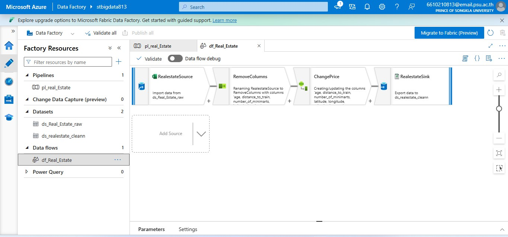

### การจัดเตรียมคอลัมน์

จัดการคอลัมน์ที่ต้องการใช้สำหรับการวิเคราะห์และการสร้างโมเดลในขั้นตอนถัดไป

  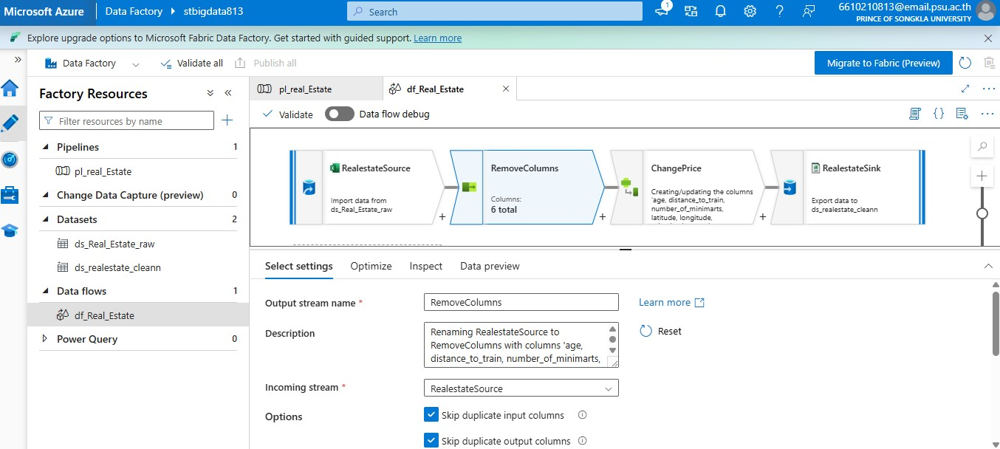

### การแปลงข้อมูลราคา

ใช้ Derived Column เพื่อแปลงค่าตัวแปรราคาของอสังหาริมทรัพย์ให้อยู่ในรูปแบบที่ต้องการ

  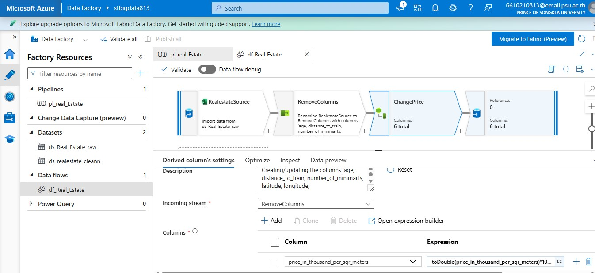

---

## 2. การวิเคราะห์ข้อมูลด้วย Azure Synapse Analytics

นำข้อมูลที่ผ่านการจัดเตรียมแล้วมาใช้งานใน Azure Synapse Analytics ผ่าน External Table

  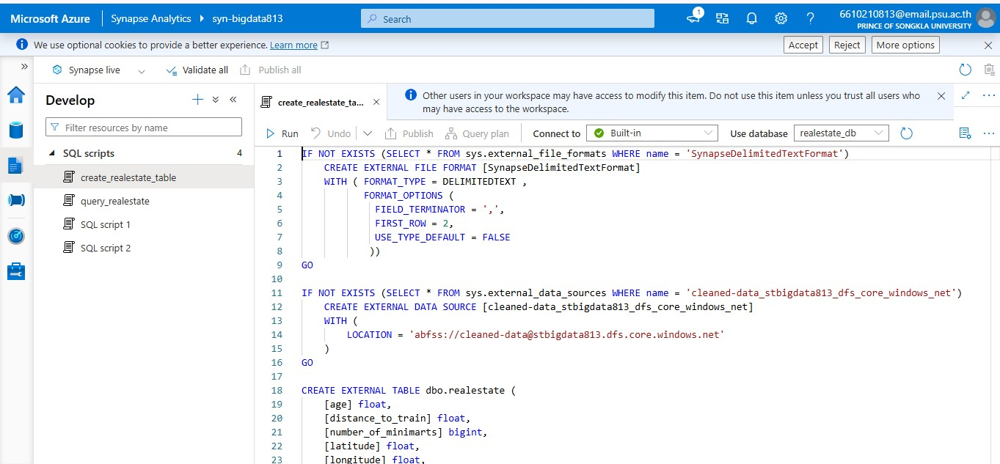

จากนั้นใช้ SQL Query เพื่อศึกษาความสัมพันธ์ระหว่างระยะทางจากสถานีรถไฟกับราคาอสังหาริมทรัพย์

  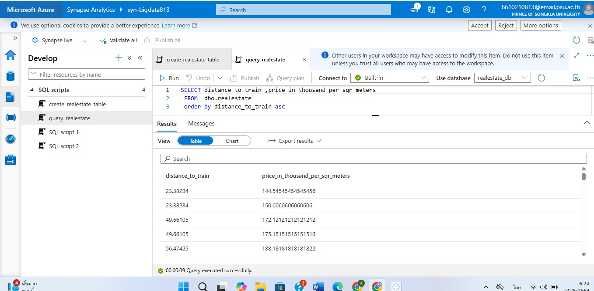

### การแสดงผลข้อมูล

สร้าง Scatter Plot เพื่อสำรวจความสัมพันธ์ระหว่างระยะทางจากสถานีรถไฟและราคาอสังหาริมทรัพย์

  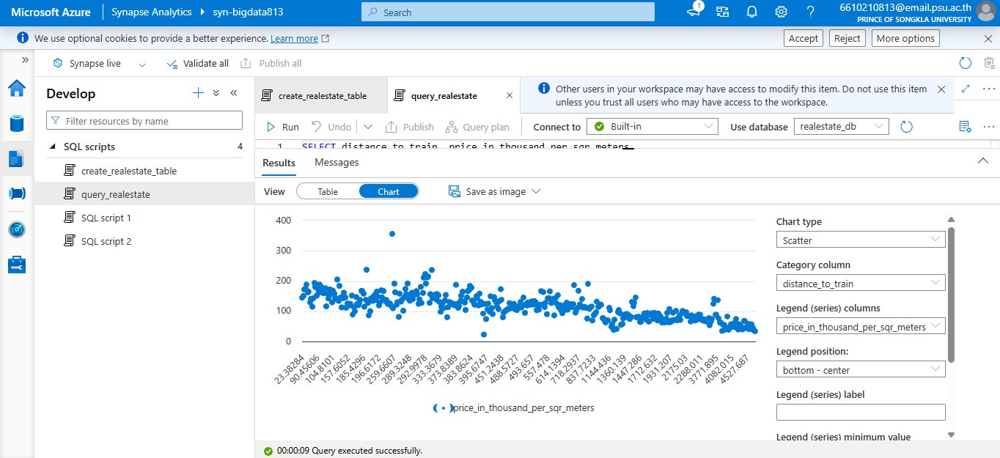

จากกราฟสามารถสังเกตแนวโน้มได้ว่า เมื่อระยะทางจากสถานีรถไฟเพิ่มขึ้น ราคาอสังหาริมทรัพย์โดยทั่วไปมีแนวโน้มลดลง

### การ Export ข้อมูล

สร้าง External Table สำหรับส่งออกข้อมูลที่ผ่านการประมวลผล เพื่อนำไปใช้งานในขั้นตอนถัดไป

  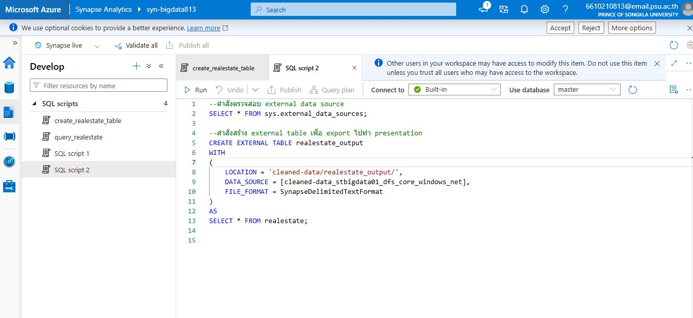

---

## 3. การสร้าง Machine Learning Model

ใช้ Azure Machine Learning Designer ในการสร้าง Machine Learning Pipeline สำหรับทำนายราคาอสังหาริมทรัพย์

Pipeline ประกอบด้วยขั้นตอนสำคัญ ได้แก่

- Split Data
- Normalize Data
- Linear Regression
- Train Model
- Apply Transformation
- Score Model
- Evaluate Model
- Export Data

  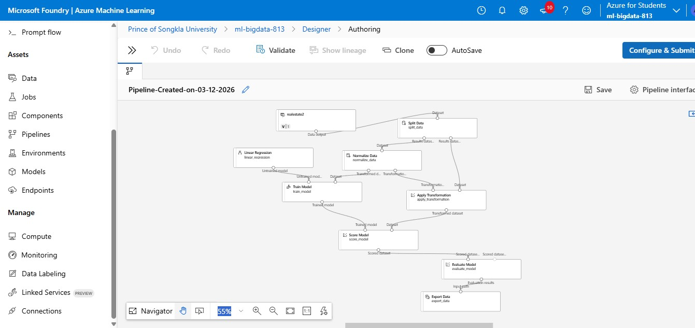

---

## 4. ผลการประเมินโมเดล

ประเมินประสิทธิภาพของ Linear Regression Model ด้วย Regression Metrics

| Metric | Result |
|---|---:|
| Mean Absolute Error (MAE) | 21.4969 |
| Root Mean Squared Error (RMSE) | 33.2854 |
| Relative Squared Error | 0.5901 |
| Relative Absolute Error | 0.6563 |
| Coefficient of Determination (R²) | ≈ 0.410 |

  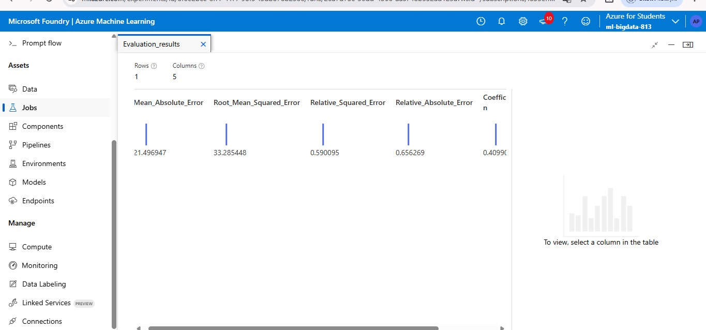

ค่า R² ประมาณ 0.41 หมายความว่าโมเดลสามารถอธิบายความแปรปรวนของราคาอสังหาริมทรัพย์ได้ประมาณ 41%

---

## 5. ผลการทำนาย

หลังจาก Train Model แล้ว ใช้ Score Model เพื่อสร้างค่าทำนาย โดยผลลัพธ์จะแสดงทั้งราคาจริงและค่าที่โมเดลทำนายในคอลัมน์ Scored Labels

  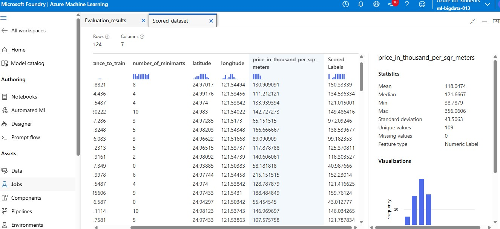

---

## 6. การสร้าง Dashboard ด้วย Power BI

นำข้อมูลอสังหาริมทรัพย์ที่ผ่านการจัดเตรียมและวิเคราะห์แล้วมาสร้าง Dashboard ด้วย Microsoft Power BI เพื่อสรุปและนำเสนอข้อมูลในรูปแบบที่เข้าใจง่าย

Dashboard ใช้สำหรับสำรวจข้อมูลและแสดงผลตัวชี้วัดสำคัญของข้อมูลอสังหาริมทรัพย์ ช่วยให้สามารถมองเห็นแนวโน้ม รูปแบบ และความสัมพันธ์ของข้อมูลได้ชัดเจนยิ่งขึ้น

  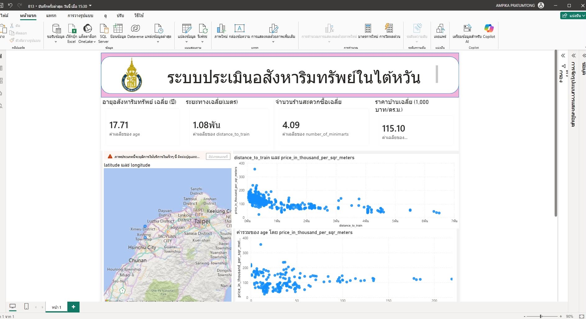

---
---

## ทักษะที่ใช้ในโปรเจกต์
- Data Analytics
- Data Cleaning
- Data Transformation
- ETL / Data Pipeline
- SQL
- Data Visualization
- Machine Learning
- Linear Regression
- Model Evaluation
- Microsoft Azure

## เครื่องมือที่ใช้

Microsoft Azure Data Factory • Azure Synapse Analytics • Azure Machine Learning • SQL
